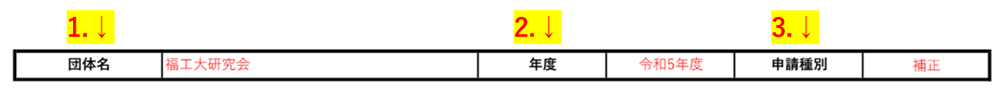
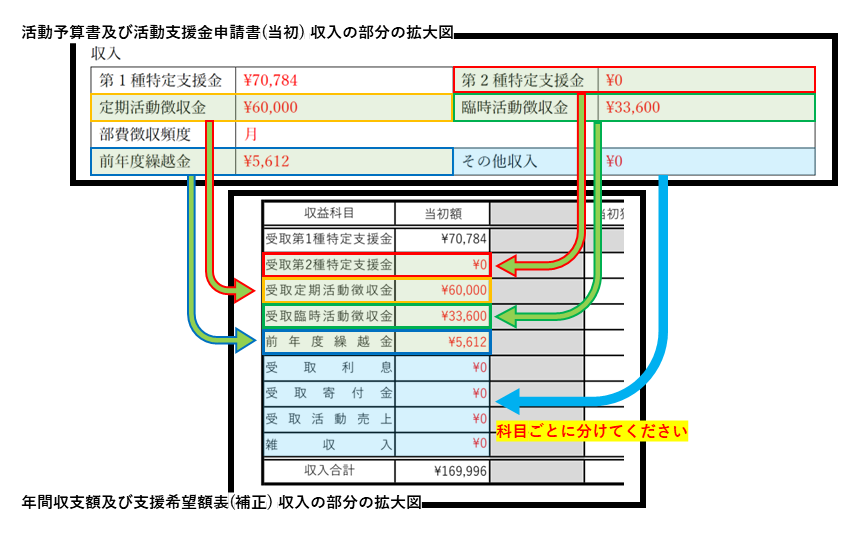
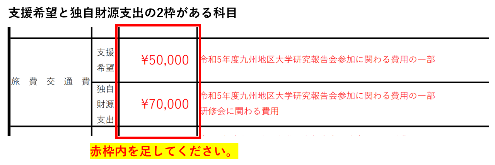
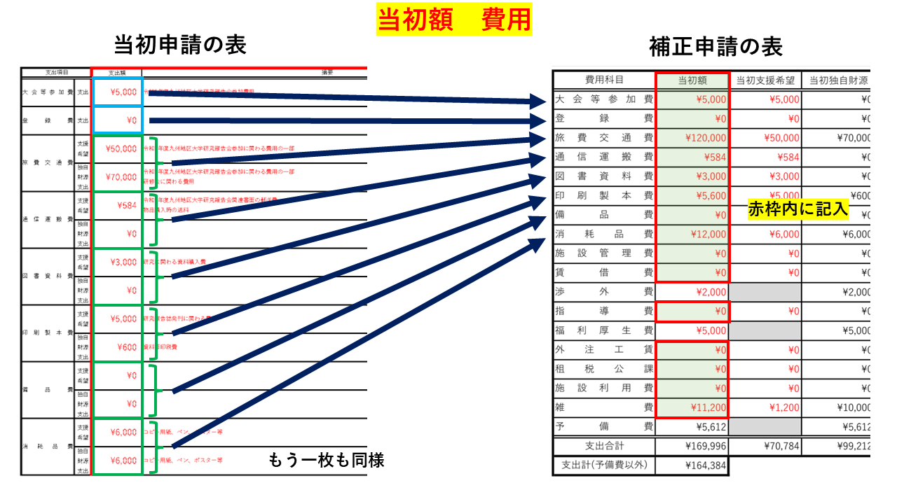
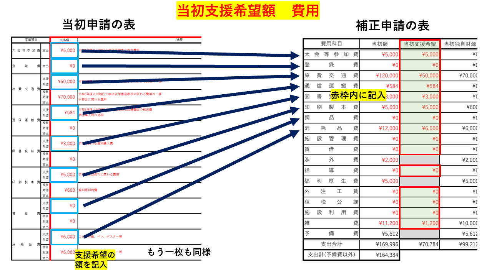
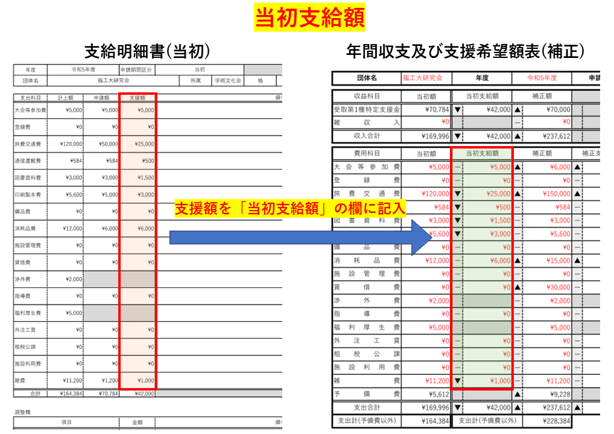
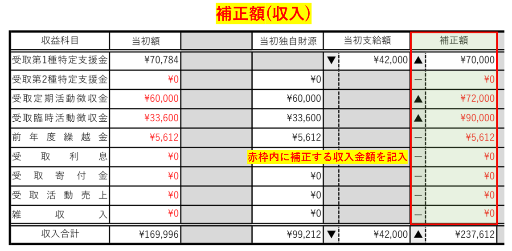
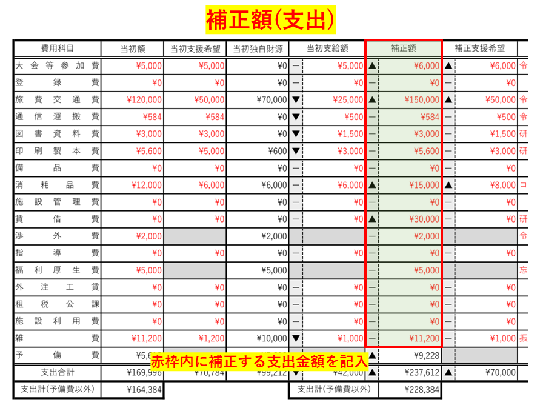
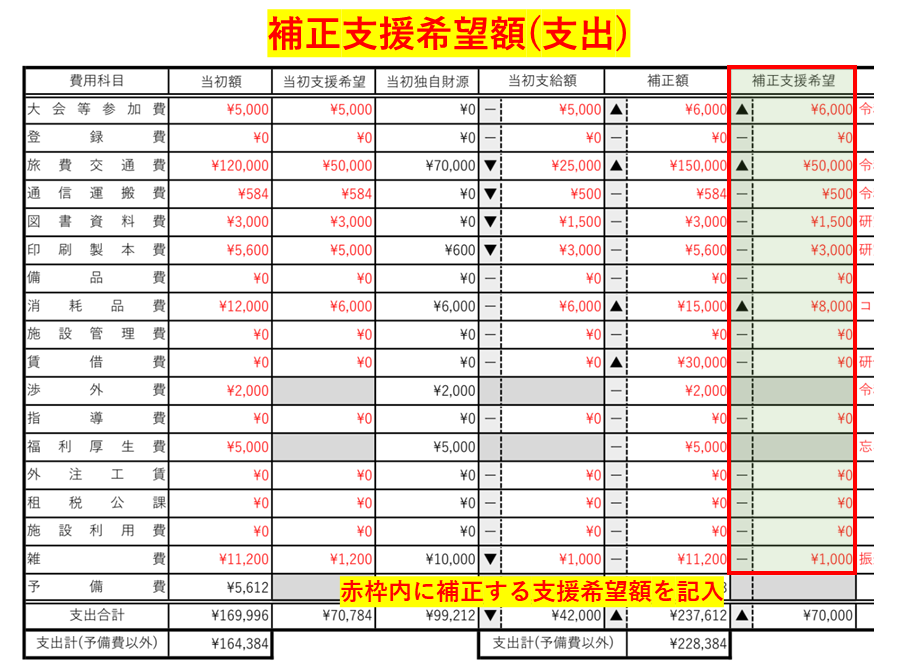

[書類の説明に戻る](./書類の説明.md)
# 年間収支額及び支援希望額表(様式2) 説明

## この書類は？
活動予算書及び活動支援金申請書で表記した申請金額を勘定科目ごとに分けて記入します。
当初申請の全体収支額・支援希望額、実際に支給された支援額(当初で支給申請した団体のみ)、補正する全体収支額・支援希望額(当初で支給申請した団体のみ)を表に纏めます。

## 提出

- **様式**  
[年間収支額及び支援希望額表-テンプレート.xlsx](https://github.com/daigi-fit/publish/raw/main/budget-and-grant/correction/distribution/%E5%B9%B4%E9%96%93%E5%8F%8E%E6%94%AF%E9%A1%8D%E5%8F%8A%E3%81%B3%E6%94%AF%E6%8F%B4%E5%B8%8C%E6%9C%9B%E9%A1%8D%E8%A1%A8-%E3%83%86%E3%83%B3%E3%83%97%E3%83%AC%E3%83%BC%E3%83%88.xlsx)(ダウンロードリンク)  
一部保護をかけています。保護箇所は記入不要な部分になっています。

- **提出条件**  
提出必須  

- **ファイルの種類**  
xlsx(Excelファイル)  

- **ファイル名**  
年間収支額及び支援希望額表-<ins>団体名</ins>.xlsx  
団体名の部分を編集してください。  
(例: 年間収支額及び支援希望額表-福工大研究会.xlsx)  

## 記入例
[こちら](./sample/年間収支額及び支援希望額表-記入例.pdf)から参照できます。赤字部分が記入箇所です。  
以下の説明と同時に閲覧することをおすすめします。

## 記入項目
7つのブロックに分かれています。
- [基本情報](#基本情報)
- [当初額](#当初額)
- [当初支援希望額](#当初支援希望額)
    - [当初独自財源](#当初独自財源)(自動計算欄)
- [当初支給額](#当初支給額)
- [補正額](#補正額)
- [補正支援希望](#補正支援希望)
- [摘要](#摘要)

*****

### 団体情報
６つの記入項目があります。

1. **団体名**  
団体の名称を記入します。正式名称で記入してください。

2. **年度**  
申請をする年度を記入します。
<string><ins>和暦</ins></string>で記入してください。  

3. **申請種別**  
申請する期間区分を記入します。**補正を選択してください。** クリックするとプルダウンメニューが表示されますので、該当する項目を選択してください。 

*****

### 当初額
- **収益(収入)**  
    <ins>当初申請</ins>で計上した収入を、科目ごとに分けて、<ins>「年間収支及び支援希望額表」の当初額の収益の欄</ins>に記入します。  
    第1種特定支援金は当初支援希望額から自動で計算されます。  

    **当初申請と補正申請の対応表**  

    | 活動予算書及び活動支援金申請書(当初) 収入記入欄　　　　 |     | 年間収支額及び支援希  望額表(補正) 当初収入記入欄 | 
    | --------------------------------------------------- | --- |   ----------------------------------------------- | 
    | 第2種特定支援金                                     | →  | 受取第2種特定支援金                          | 
    | 定期活動徴収金                                      | →  | 受取定期活動徴収金                              | 
    | 臨時活動徴収金                                      | →  | 受取臨時活動徴収金                              | 
    | 前年度繰越金                                        | →  | 前年度繰越金                                    | 
    | その他収入                                          | →  | 受取利息                                        | 
    |                                                     | ↳  | 受取寄付金                                      | 
    |                                                     | ↳  | 受取活動売上                                    | 
    |                                                     | ↳  | 雑収入                                          | 

    **対応図**  

    

    「その他収入」は、「受取利息」、「受取寄付金」、「受取活動売上」、「雑収入」に分けてください。  

- **費用(支出)**  
    <ins>当初申請</ins>で計上した支出の合計額を、科目ごとに分けて、<ins>「年間収支及び支援希望額表」の当初額の費用の欄</ins>に記入します。  
    「旅費交通費」、「通信運搬費」、「図書資料費」、「印刷製本費」、「備品費」、「消耗品費」、「施設管理費」、「賃借費」、「指導費」、「外注工賃」、「雑費」は、<ins>支援希望</ins>と<ins>独自財源支出</ins>を合計した金額を記入します。  
    その他の科目は、同じ金額を記入してください。  
    「予備費」は総収入と総支出の差で、自動計算されます。  
    
    
*****

### 当初支援希望額
- **費用(支出)**  
    <ins>当初申請</ins>で計上した**支援希望額**を、科目ごとに分けて、<ins>「年間収支及び支援希望額表」の当初支援希望額の欄</ins>に記入します。グレー背景の部分は記入できません。  
    「旅費交通費」、「通信運搬費」、「図書資料費」、「印刷製本費」、「備品費」、「消耗品費」、「施設管理費」、「賃借費」、「指導費」、「外注工賃」、「雑費」の科目は、<ins>支援希望</ins>の欄の金額を記入します。  
    「大会等参加費」、「登録費」、「租税公課」、「施設利用費」は、<ins>支出</ins>の欄の金額を記入します。  
    

*****

### 当初独自財源(記入不要)
**このブロックは自動計算されます。** 記入が必要な欄はありません。

- **収益(収入)**  
当初額のうち、独自財源の収入の金額です。

- **費用(支出)**  
当初額のうち、独自財源で支出する金額です。

*****

### 当初支給額
- **収益(収入)**  
**この欄は自動計算されます。** 記入が必要な欄はありません。  
当初申請で支給された第1種特定支援金(活動支援金)の総支給額です。  
当初支給額の費用欄から自動で計算されます。

- **費用(支出)**  
<ins>当初申請で支給された第1種特定支援金(活動支援金)の科目別支給額</ins>を記入します。  
当初申請での支給額は、**支援金受取の際に渡された封筒の中の「支給明細書」の支援額の欄に表記**されています。   

*****
**補正とは？**  
補正とは、当初申請で提出・申請した予算や活動支援金の額を変更することをいいます。  
年度初めに作った年間の予算と支援希望金額を、10月に年間予算を再度計算しなおして、不足をなくそうとすることです。  
なので、当初の時と比べて増減少する科目があると思います。

*****

### 補正額
- **収益(収入)**  
補正する収入の金額を、科目ごとに分けて、<ins>「年間収支及び支援希望額表」の補正額の収益の欄</ins>に記入します。  
第1種特定支援金は当初支援希望額から自動で計算されます。   
  

- **費用(支出)**  
補正する支出の金額を、科目ごとに分けて、<ins>「年間収支及び支援希望額表」の補正額の費用の欄</ins>に記入します。  
この欄は、総支出額を記入してください。  
「予備費」は総収入と総支出の差で、自動計算されます。  
  

*****

### 補正支援希望
- **費用(支出)**  
補正した科目ごとの支出に基づいて、補正をする支援希望額を記入します。

*****

### 摘要
それぞれの科目ごとに、どういう使途なのかを簡潔に記述してください。

*****

## 戻る
[上に戻る](#年間収支額及び支援希望額表様式2-説明)  
[書類の説明に戻る](./書類の説明.md)  